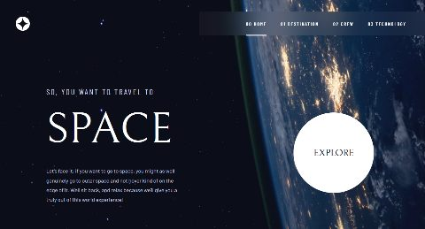

# Landing Page - Space Tourism

## :bookmark_tabs: Menu

- [Overview](#scroll-overview)
- [Screenshot](#rice_scene-screenshot)
- [Requirements](#heavy_exclamation_mark-requirements)
- [Installation and usage](#installation-and-usage)
- [Deploy](#deploy)
- [Authors](#smiley_cat-authors)
- [License](#memo-license)

## :scroll: Overview

Landing page inspirada em turismo espacial, desenvolvida com o objetivo de praticar e demonstrar conhecimentos de desenvolvimento web e construção de interfaces responsivas.

O projeto apresenta informações sobre destinos espaciais, tripulação e tecnologias utilizadas nas viagens, com navegação entre diferentes seções da aplicação.

## :rice_scene: Screenshot

<!-- subir screenshot do read me (ver tutorial)-->



## Requirements

<!-- etapas para instalar projeto na máquina -->

Abra seu terminal e execute os seguintes comandos:

1. Clone o repositório:

```bash
git clone https://github.com/gtakahatadev/space-tourism-website-main.git
cd space-tourism-website-main
```

2. Abra o arquivo `index.html` no seu navegador.

## Demo ao vivo

https://space-tourism-website-main-mou8.vercel.app/

## Authors

Gabriel Takahata

## License

<!-- pesquisar licença de projeto -->

This project is licensed under the MIT License.

The MIT License applies to the source code created for this project. 
Images, icons, and other design assets are not covered by this license.